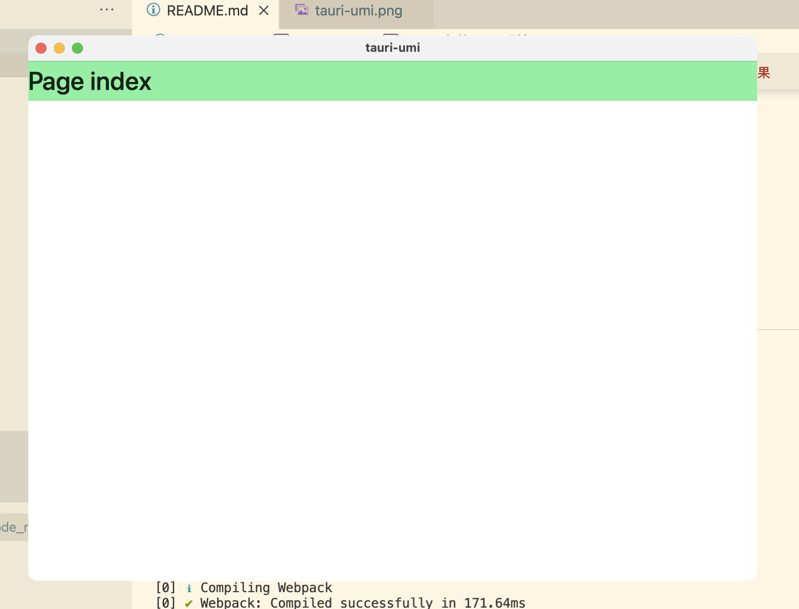

# tauri-umi
#### 安装umi
`yarn create @umijs/umi-app`
`npm i`
#### 安装 rust 环境
 参考 
 [官网安装教程-Rust 编译工具](https://www.rust-lang.org/zh-CN/tools/install)

 [菜鸟教程](https://www.runoob.com/rust/rust-setup.html)

 Rust 的编译工具依赖 C 语言的编译工具，这意味着你的电脑上至少已经存在一个 C 语言的编译环境。如果你使用的是 Linux 系统，往往已经具备了 GCC 或 clang。如果你使用的是 macOS，需要安装 Xcode。如果你是用的是 Windows 操作系统，你需要安装 Visual Studio 2013 或以上的环境（需要 C/C++ 支持）以使用 MSVC 或安装 MinGW + GCC 编译环境（Cygwin 还没有测试）。
1. windows 环境 
```
    Rust 编译工具推荐使用刚才从上方链接中下载的 Rustup 安装。下载好的 Rustup 在 Windows 上是一个可执行程序 rustup-init.exe。（在其他平台上应该是 rustup-init.sh ）。
```
2. mac 或 linux 在终端中执行 `curl --proto '=https' --tlsv1.2 -sSf https://sh.rustup.rs | sh`
```
xxxx:tauri-umi xxx$ curl --proto '=https' --tlsv1.2 -sSf https://sh.rustup.rs | sh
info: downloading installer

Welcome to Rust!

This will download and install the official compiler for the Rust
programming language, and its package manager, Cargo.

Rustup metadata and toolchains will be installed into the Rustup
home directory, located at:

  /Users/xxx/.rustup

This can be modified with the RUSTUP_HOME environment variable.

The Cargo home directory located at:

  /Users/xxx/.cargo

This can be modified with the CARGO_HOME environment variable.

The cargo, rustc, rustup and other commands will be added to
Cargo's bin directory, located at:

  /Users/xxx/.cargo/bin

This path will then be added to your PATH environment variable by
modifying the profile files located at:

  /Users/xxx/.profile
  /Users/xxx/.bash_profile
  /Users/xxx/.zshenv

You can uninstall at any time with rustup self uninstall and
these changes will be reverted.

Current installation options:


   default host triple: x86_64-apple-darwin
     default toolchain: stable (default)
               profile: default
  modify PATH variable: yes

1) Proceed with installation (default)
2) Customize installation
3) Cancel installation
>1

```
这里选1 default 就好
```

info: profile set to 'default'
info: default host triple is x86_64-apple-darwin
warning: Updating existing toolchain, profile choice will be ignored
info: syncing channel updates for 'stable-x86_64-apple-darwin'
info: default toolchain set to 'stable-x86_64-apple-darwin'

  stable-x86_64-apple-darwin unchanged - rustc 1.56.1 (59eed8a2a 2021-11-01)


Rust is installed now. Great!

To get started you may need to restart your current shell.
This would reload your PATH environment variable to include
Cargo's bin directory ($HOME/.cargo/bin).

To configure your current shell, run:
source $HOME/.cargo/env
```
在终端执行一下 `source $HOME/.cargo/env`
安装完成后，输入 `rustc -V` 查看rust版本信息输出
`rust` 包管理器是 `cargo` 输入 `cargo -V`查看版本输出

**注意：使用vscode编辑rust时需要安装c/c++扩展才能正常启动调试器**

#### 全局安装tauri打包工具
`cargo install tauri-bundler --force`
在这个过程中可能会报某些包没有，不要慌，缺什么就安装什么

#### 使用tauri
在直接在当前项目下 执行`npm install tauri -S`或者 `yarn add tauri -S`
完成后进行 初始化
`npx tauri init`
一样，初始化过程中，如果报错缺少什么模块，缺什么装什么。
执行完成，会自动生成一个 `rust` 项目 `src-tauri`
#### src-tauri/tauri.conf.json
```
"build": {
    "distDir": "../build", //打包后的路径
    "devPath": "http://localhost:8080", // 此为 dev 启动时的url
    "beforeDevCommand": "",
    "beforeBuildCommand": ""
  },
```
#### 配置package.json
```
scripts:{
  ...
  "start": "concurrently \"npm run start:web\"  \"npm run start:tauri\"",
  "start:web": "umi dev",
  "start:tauri": "tauri dev",
  "build": "npm run build:web &&  npm run build:tauri",
  "build:web": "umi build",
  "build:tauri": "tauri build",
  ...
}
```
**注意**
所有依赖安装好了之后，先运行一次 `npm run start:tauri`。这时，`cargo` 会给 `rust` 项目安装依赖。过程会比较慢，有可能会因为网络问题导致安装失败，不要慌，多尝试几次。安装完成后。`ctrl+c` 推出，然后再使用 `npm run start` 一次性启动整个项目

